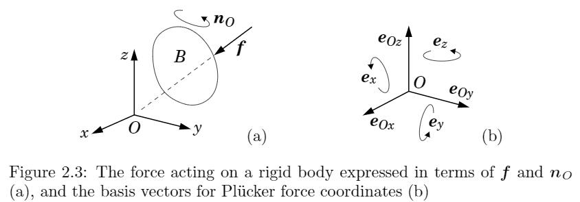

#! https://zhuanlan.zhihu.com/p/372847498

# 《刚体动力学算法笔记》Chapter2: 空间向量代数(一)

## 空间向量代数(Spatial Vector Algebra)介绍
空间向量结合了刚体的线性运动、转动两个层面。本章主要推导单刚体的空间向量代数表示。

## 数学定义
### 向量和向量空间（Vectors and Vector Spaces）
线性代数中，向量是向量空间的一个元素。本书中常用的四种向量空间如下：
* $R^n$: 坐标向量空间( coordinate vectors): n个实数的元组，或者$n\times 1$的矩阵，用于表示其他抽象向量(abstract vector)。
* $E^n$:欧几里德向量空间( Euclidean vectors):具有大小和方向的欧式空间向量。
* $M^n$:空间运动向量( spatial motion vectors):描述刚体运动，如速度、加速度
$F^n$:空间力向量(spatial force vectors):描述刚体受力，如脉冲力、力矩。

空间向量不属于$E^n$，而属于$M^n \cup    F^n$。 
*  **命名约定**: 当空间向量和3D向量同时同名出现时，我们使用 $\hat{v},\hat{f}$来表示空间向量。当坐标向量和抽象向量同时出现时，我们使用$\underline{v}$来表示坐标向量。

### 向量对偶空间(ual of a Vector Space)
令$V$是一个向量空间。它的对偶$V^*$为跟$V$维度相同的向量空间，并且含有跟$V$的标量乘法(scalar product)定义,$u \cdot v$ or $v \cdot u$。对偶具有对称性，即如果$U=V^{*}$ 则 $V=U^{*}$。$M^n$和$F^n$是对偶的，它们的元素标量乘法$m \cdot f$物理上代表了功率。

标量乘法的定义需要满足非奇异性(nondegenerate or nonsingular)， 即如果对于$v \in V$，如果$v \neq 0$，则至少存在一个向量$u \in V^{*}$，满足$v \cdot u \neq 0$。非奇异性保证了$V$和$V^*$的对偶基向量一定存在。
### 对偶基(Dual Bases)
假设我们有两个向量空间， $V=U^{*}$，令$\mathcal{D}=\left\{\boldsymbol{d}_{1}, \ldots, \boldsymbol{d}_{n}\right\}$是$U$的基向量，$\mathcal{E}=\left\{\boldsymbol{e}_{1}, \ldots, \boldsymbol{e}_{n}\right\}$是$V$的基向量。如果它们满足下面互换条件(eciprocity condition)，则构成对偶基(dual basis):
$$
d_{i} \cdot e_{j}=\left\{\begin{array}{ll}
1 & \text { if } i=j \\
0 & \text { otherwise. }
\end{array}\right.
$$
一个特殊情况是当$\mathcal{D}=\mathcal{E}$时，基是正交的，此时$U=V=\mathrm{E}^{n}$。
### 对偶坐标系(Dual Coordinates)
我们使用Plücker坐标系来表示对偶坐标系统。其有一个特定性质:
$$\boldsymbol{u} \cdot \boldsymbol{v}=\underline{\boldsymbol{u}}^{\mathrm{T}} \underline{\boldsymbol{v}}$$
其中$\boldsymbol{u} \in U, \boldsymbol{v} \in V$。$\underline{u}$和$\underline{v}$是$u$和$v$在对偶坐标系$\mathcal{D}$ 和 $\mathcal{E}$中的表示。则$\underline{u}$和$\underline{v}$中的每个元素可以表示为:
$$u_{i}=e_{i} \cdot u \quad ,  \quad v_{i}=d_{i} \cdot v
$$
### $a\cdot$和$a \times$运算符
可以将$a \cdot $ 看做$a \cdot b$中对b的运算操作，$a \cdot$将$b$映射到标量$a \cdot b$， $a \times b$将$b$映射到$a \times b$。下表中列出了一些运算性质，其中$a \times ^*$是$a \times$的对偶运算。
$$
\begin{array}{l}
\boldsymbol{v} \times^{*}=-\boldsymbol{v} \times{ }^{T}\\
(\lambda \boldsymbol{v}) \times=\lambda(\boldsymbol{v} \times) \quad(\lambda \boldsymbol{v}) \times^{*}=\lambda\left(\boldsymbol{v} \times^{*}\right) \quad (\lambda \text { is a scalar) }\\
(\boldsymbol{u}+\boldsymbol{v}) \times=\boldsymbol{u} \times+\boldsymbol{v} \times \quad(\boldsymbol{u}+\boldsymbol{v}) \times^{*}=\boldsymbol{u} \times^{*}+\boldsymbol{v} \times^{*}\\
(\boldsymbol{X} \boldsymbol{v}) \times=\boldsymbol{X} \boldsymbol{v} \times \boldsymbol{X}^{-1} \quad(\boldsymbol{X} \boldsymbol{v}) \times^{*}=\boldsymbol{X}^{*} \boldsymbol{v} \times^{*}\left(\boldsymbol{X}^{*}\right)^{-1} \quad \text { (Plücker transform) }\\
u \times v=-v \times u\\
(\boldsymbol{u} \times \boldsymbol{v}) \cdot=-\boldsymbol{v} \cdot \boldsymbol{u} \times^{*} \quad\left(\boldsymbol{u} \times{ }^{*} \boldsymbol{f}\right) \cdot=-\boldsymbol{f} \cdot \boldsymbol{u} \times\\
(u \times v) \times=u \times v \times-v \times u \times \quad(u \times v) \times^{*}=u \times^{*} v \times^{*}-v \times^{*} u \times^{*}
\end{array}
$$
### 双积( Dyads and Dyadics)
$a b\cdot$叫做dyad，是从向量到向量的线性映射,如将$c$映射到$a(b \cdot c)$。
dyadic是向量的线性映射。任何dyadic可以表达为dyads的线性和,可以应用于空间惯性张量。
$$
\boldsymbol{L}=\sum_{i=1}^{r} \boldsymbol{a}_{i} \boldsymbol{b}_{i}
$$
## 空间速度
对于任一空间点P，其速度可以表示为:
$$
v_{P}=v_{O}+\omega \times \overrightarrow{O P}
$$
其中$O$是刚体$B$上选定点。我们建立笛卡尔坐标系$O_{xyz}$，定义其正交基为:$\{\boldsymbol{i}, \boldsymbol{j}, \boldsymbol{k}\} \subset \mathrm{E}^{3}$,则角速度$\omega$和线速度$v_O$可以表示为:
$$\omega=\omega_{x} i+\omega_{y} j+\omega_{z} k \quad, \quad \boldsymbol{v}_{O}=v_{O x} \boldsymbol{i}+v_{O y} j+v_{O z} \boldsymbol{k}$$
我们的目标是得到表示相同运动的空间速度向量$\hat{\boldsymbol{v}} \in \mathrm{M}^{6}$。首先定义$M^6$上的基:
$\mathcal{D}_{O}=\left\{\boldsymbol{d}_{O x}, \boldsymbol{d}_{O y}, \boldsymbol{d}_{O z}, \boldsymbol{d}_{x}, \boldsymbol{d}_{y}, \boldsymbol{d}_{z}\right\} \subset \mathrm{M}^{6}$,如图所示，其中$d_{O x}、d_{O y}、d_{O z}$是绕$O_x,O_y,O_z$的单位旋转。因此可得：

$$
\hat{v}=\omega_{x} d_{O x}+\omega_{y} d_{O y}+\omega_{z} d_{O z}+v_{O x} d_{x}+v_{O y} d_{y}+v_{O z} d_{z}
$$
在$\mathcal{D}_{O}$坐标系中可以表达为:
$$
\hat{\underline{v}}_{O}=\left[\begin{array}{c}
\omega_{x} \\
\omega_{y} \\
\omega_{z} \\
v_{O x} \\
v_{O y} \\
v_{O z}
\end{array}\right]=\left[\begin{array}{c}
\underline{\boldsymbol{\omega}} \\
\underline{\boldsymbol{v}}_{O}
\end{array}\right]
$$

虽然上式中选择固定点$O$，可以证明空间向量跟选择的坐标原点无关。这里我们定义点$P$为原点，对应的速度为$\hat{v}^{\prime}$。而$\hat{v}^{\prime}=\hat{v}$。因此$\hat{v}^{\prime}$可以表达为:
$$
\hat{\boldsymbol{v}}^{\prime}=\omega_{x} \boldsymbol{d}_{P x}+\omega_{y} \boldsymbol{d}_{P y}+\omega_{z} \boldsymbol{d}_{P z}+v_{P x} \boldsymbol{d}_{x}+v_{P y} \boldsymbol{d}_{y}+v_{P z} \boldsymbol{d}_{z} \tag{1}
$$
不妨选择$P$在$O_{xyz}$中的位置是$(r,0,0)$，如下图所示。此时在$O_{xyz}$坐标系下的线速度为:

$$
\left[\begin{array}{l}
v_{P x} \\
v_{P y} \\
v_{P z}
\end{array}\right]=\underline{v}_{O}+\underline{\omega} \times\left[\begin{array}{l}
r \\
0 \\
0
\end{array}\right]=\left[\begin{array}{c}
v_{O x} \\
v_{O y}+\omega_{z} r \\
v_{O z}-\omega_{y} r
\end{array}\right]
$$
另外，在新坐标系$P_{xyz}$下的基向量为:
$$
\begin{array}{l}
d_{P x}=d_{O x} \\
d_{P y}=d_{O y}+r d_{z} \\
d_{P z}=d_{O z}-r d_{y} .
\end{array}
$$
可得:
$$
\begin{aligned}
\hat{\boldsymbol{v}}^{\prime}=& \omega_{x} \boldsymbol{d}_{O x}+\omega_{y}\left(\boldsymbol{d}_{O y}+r \boldsymbol{d}_{z}\right)+\omega_{z}\left(\boldsymbol{d}_{O z}-r \boldsymbol{d}_{y}\right) \\
&+v_{O x} \boldsymbol{d}_{x}+\left(v_{O y}+\omega_{z} r\right) d_{y}+\left(v_{O z}-\omega_{y} r\right) d_{z}
\end{aligned}
$$
跟$O_{xyz}$的坐标表达公式(1)相同。
## 空间力
作用在刚体$B$上的广义力由一个通过原点$O$的线性力$f$和一个力偶$n_O$组成。同理，我们可以计算任一点$P$的总力矩为:
$$
n_{P}=n_{O}+f \times \overrightarrow{O P}
$$
引入笛卡尔坐标系$O_{xyz}$，其正交基$\{\boldsymbol{i}, \boldsymbol{j}, \boldsymbol{k}\} \in \mathrm{E}^{3}$。则$n_O$和$f$在笛卡尔坐标下的表示为:
$$
\boldsymbol{n}_{O}=n_{O x} \boldsymbol{i}+n_{O y} \boldsymbol{j}+n_{O z} \boldsymbol{k} \quad ,\quad f=f_{x} i+f_{y} j+f_{z} k
$$
这个坐标系也定义了$F^6$上的Plücker基$\mathcal{E}_{O}=\left\{\boldsymbol{e}_{x}, \boldsymbol{e}_{y}, \boldsymbol{e}_{z}, \boldsymbol{e}_{O x}, e_{O y}, e_{O z}\right\} \subset \mathrm{F}^{6}$

同理，如果$\hat{f} \in \mathrm{F}^{6}$是同样的空间力，则:
$$
\hat{f}=n_{O x} e_{x}+n_{O y} e_{y}+n_{O z} e_{z}+f_{x} e_{O x}+f_{y} e_{O y}+f_{z} e_{O z}
$$
在$\mathcal{E}_{O}$坐标系下的表示为:
$$
\underline{\hat{f}}_{O}=\left[\begin{array}{c}
n_{O x} \\
n_{O y} \\
n_{O z} \\
f_{x} \\
f_{y} \\
f_{z}
\end{array}\right]=\left[\begin{array}{c}
\underline{n}_{O} \\
\underline{f}
\end{array}\right]
$$
## 线向量和自由向量(Line Vectors and Free Vectors)
线向量是由带方向的线和大小决定的量，比如刚体纯旋转、线性作用力是线向量。自由向量是由方向和大小决定的量，比如刚体位移、力矩作用。一个线向量可以由一个自由向量和线上的任一点确定。

设$\hat{s}$是一个代表运动或者力的空间向量，在Plücker坐标系下由$s$和$s_O$两个3D坐标向量组成。则:
* 如果$s=0$,则$\hat{s}$是自由向量。
* 如果$s \cdot s_O=0$则$\hat{s}$是线向量。线方向由$s$给定，线上的点满足$\overrightarrow{O P} \times s=s_{O}$。
* 任何空间向量可以表示为线向量和自由向量的和。
* 任何不是自由向量的空间向量，可以如下唯一表示为线向量和平行的自由向量的和，即可以表示为一条带方向的线+线性方向的大小+角度朝向的大小。
$$
\left[\begin{array}{c}
s \\
s_{O}-h s
\end{array}\right]+\left[\begin{array}{c}
0 \\
h s
\end{array}\right] \quad \text { where } \quad h=\frac{s \cdot s_{O}}{s \cdot s}
$$
根据旋量理论，刚体运动可以标表示为绕空间轴线的旋转和沿着轴线的位移，称为twist；作用在刚体上的广义力可以表示为一个线性力和沿着力方向的力矩,成为wrench，分别对应$M^6$和$F^6$上的元素。

## 标量乘积(Scalar Product)
标量乘积构成了$M^6$和$F^6$空间的对偶联系。这里进一步定义对偶坐标系统的基:$\left\{\boldsymbol{d}_{1}, \ldots, \boldsymbol{d}_{6}\right\} \subset \mathrm{M}^{6}$ 和 $\left\{\boldsymbol{e}_{1}, \ldots, e_{6}\right\} \subset \mathrm{F}^{6}$，满足以下关系:
$$
d_{i} \cdot e_{j}=\left\{\begin{array}{ll}
1 & \text { if } i=j \\
0 & \text { otherwise }
\end{array}\right.
$$
此时，如果一个矩阵$M$代表运动向量的变换，$X^*$代表力向量的变换，则满足:
$$
\boldsymbol{X}^{*}=\boldsymbol{X}^{-\mathrm{T}}
$$

## 使用空间向量
空间向量用于表达和分析刚体系统和刚体动力学。这里简单说明其和实际物理系统的联系:
* **用途:**$M^6$上元素描述刚体运动，如速度、加速度、无限小位移、运动自由度和约束的方向。$F^6$上的元素描述作用在刚体上的力，如力矩、脉冲力、力自由度和约束的方向。
* **唯一性:** $M^6$上元素和刚体运动1：1映射，$F^6$同理。
* **相对性:** 如果刚体$B_1,B_2$的速度分别为$v_1,v_2$。$B_2$相对$B_1$的速度为:$\boldsymbol{v}_{r e l}=\boldsymbol{v}_{2}-\boldsymbol{v}_{1}$。相对加速度为$\boldsymbol{a}_{r e l}=\boldsymbol{a}_{2}-\boldsymbol{a}_{1}$。
* **累积性:** 力空间向量可以累加。惯量也可以累积，如果两个刚体固接，整体惯量为:$I=I_1+I_2$。
* **运动方程:** $\boldsymbol{f}=\mathrm{d} / \mathrm{d} t(\boldsymbol{I} \boldsymbol{v})=\boldsymbol{I} a+\boldsymbol{v} \times^{*} \boldsymbol{I} \boldsymbol{v}$

> 如图所示运动链，$v_i$代表第i个刚体的速度，$v_{Ji}$代表关节i的速度，则:
> $$
\boldsymbol{v}_{\mathrm{J} i}=\boldsymbol{v}_{i}-\boldsymbol{v}_{i-1}
> $$
> 因为关节只有一个自由度，可以表示成轴向量和速度向量:$\boldsymbol{v}_{\mathrm{J} i}=\boldsymbol{s}_{i} \dot{q}_{i}$。则:
> $$
\boldsymbol{v}_{i}=\boldsymbol{v}_{i-1}+\boldsymbol{s}_{i} \dot{q}_{i} =\sum_{j=1}^{i} s_{j} \dot{q}_{j} \quad\left(\boldsymbol{v}_{0}=\mathbf{0}\right)
> $$
> 或者可以表示为矩阵形式，其中$J_i$是$6 \times N$的Jacobian，$\dot{q}$是关节空间速度向量:
> $$
v_{i}=\left[\begin{array}{lllllll}
s_{1} & s_{2} & \cdots & s_{i} & 0 & \cdots & 0
\end{array}\right]\left[\begin{array}{c}
\dot{q}_{1} \\
\vdots \\
\dot{q}_{N}
\end{array}\right]=J_{i} \dot{q}
> $$
>  