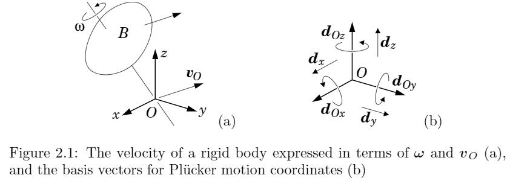
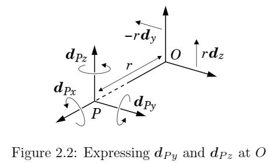
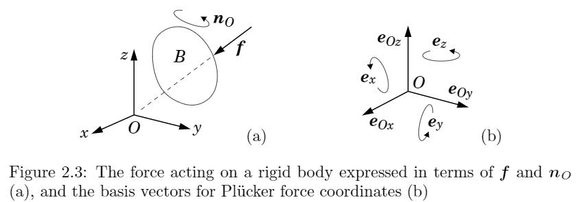
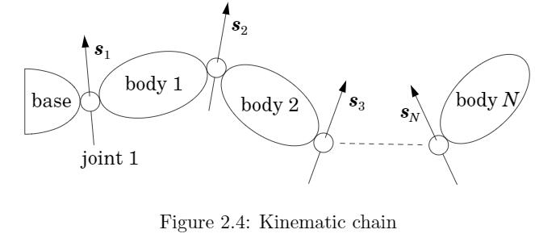

# 《刚体动力学算法笔记》Chapter2: 空间向量代数(一)

## 空间向量代数(Spatial Vector Algebra)介绍
空间向量结合了刚体的线性运动、转动两个层面。本章主要推导单刚体的空间向量代数表示。

## 数学定义
### 向量和向量空间（Vectors and Vector Spaces）
线性代数中，向量是向量空间的一个元素。本书中常用的四种向量空间如下：
*   : 坐标向量空间( coordinate vectors): n个实数的元组，或者  的矩阵，用于表示其他抽象向量(abstract vector)。
*   :欧几里德向量空间( Euclidean vectors):具有大小和方向的欧式空间向量。
*   :空间运动向量( spatial motion vectors):描述刚体运动，如速度、加速度
  :空间力向量(spatial force vectors):描述刚体受力，如脉冲力、力矩。

空间向量不属于  ，而属于  。 
*  **命名约定**: 当空间向量和3D向量同时同名出现时，我们使用   来表示空间向量。当坐标向量和抽象向量同时出现时，我们使用  来表示坐标向量。

### 向量对偶空间(ual of a Vector Space)
令  是一个向量空间。它的对偶  为跟  维度相同的向量空间，并且含有跟  的标量乘法(scalar product)定义,   or   。对偶具有对称性，即如果   则   。  和  是对偶的，它们的元素标量乘法  物理上代表了功率。

标量乘法的定义需要满足非奇异性(nondegenerate or nonsingular)， 即如果对于  ，如果  ，则至少存在一个向量  ，满足  。非奇异性保证了  和  的对偶基向量一定存在。
### 对偶基(Dual Bases)
假设我们有两个向量空间，   ，令  是  的基向量，  是  的基向量。如果它们满足下面互换条件(eciprocity condition)，则构成对偶基(dual basis):

一个特殊情况是当  时，基是正交的，此时  。
### 对偶坐标系(Dual Coordinates)
我们使用Plücker坐标系来表示对偶坐标系统。其有一个特定性质:

其中  。  和  是  和  在对偶坐标系   和   中的表示。则  和  中的每个元素可以表示为:

###   和  运算符
可以将   看做  中对b的运算操作，  将  映射到标量  ，   将  映射到  。下表中列出了一些运算性质，其中  是  的对偶运算。

### 双积( Dyads and Dyadics)
  叫做dyad，是从向量到向量的线性映射,如将  映射到  。
dyadic是向量的线性映射。任何dyadic可以表达为dyads的线性和,可以应用于空间惯性张量。

## 空间速度
对于任一空间点P，其速度可以表示为:

其中  是刚体  上选定点。我们建立笛卡尔坐标系  ，定义其正交基为:  ,则角速度  和线速度  可以表示为:

我们的目标是得到表示相同运动的空间速度向量  。首先定义  上的基:
  ,如图所示，其中  是绕  的单位旋转。因此可得：

在  坐标系中可以表达为:

虽然上式中选择固定点  ，可以证明空间向量跟选择的坐标原点无关。这里我们定义点  为原点，对应的速度为  。而  。因此  可以表达为:

不妨选择  在  中的位置是  ，如下图所示。此时在  坐标系下的线速度为:

另外，在新坐标系  下的基向量为:

可得:

跟  的坐标表达公式(1)相同。
## 空间力
作用在刚体  上的广义力由一个通过原点  的线性力  和一个力偶  组成。同理，我们可以计算任一点  的总力矩为:

引入笛卡尔坐标系  ，其正交基  。则  和  在笛卡尔坐标下的表示为:

这个坐标系也定义了  上的Plücker基  

同理，如果  是同样的空间力，则:

在  坐标系下的表示为:

## 线向量和自由向量(Line Vectors and Free Vectors)
线向量是由带方向的线和大小决定的量，比如刚体纯旋转、线性作用力是线向量。自由向量是由方向和大小决定的量，比如刚体位移、力矩作用。一个线向量可以由一个自由向量和线上的任一点确定。

设  是一个代表运动或者力的空间向量，在Plücker坐标系下由  和  两个3D坐标向量组成。则:
* 如果  ,则  是自由向量。
* 如果  则  是线向量。线方向由  给定，线上的点满足  。
* 任何空间向量可以表示为线向量和自由向量的和。
* 任何不是自由向量的空间向量，可以如下唯一表示为线向量和平行的自由向量的和，即可以表示为一条带方向的线+线性方向的大小+角度朝向的大小。

根据旋量理论，刚体运动可以标表示为绕空间轴线的旋转和沿着轴线的位移，称为twist；作用在刚体上的广义力可以表示为一个线性力和沿着力方向的力矩,成为wrench，分别对应  和  上的元素。

## 标量乘积(Scalar Product)
标量乘积构成了  和  空间的对偶联系。这里进一步定义对偶坐标系统的基:   和   ，满足以下关系:

此时，如果一个矩阵  代表运动向量的变换，  代表力向量的变换，则满足:

## 使用空间向量
空间向量用于表达和分析刚体系统和刚体动力学。这里简单说明其和实际物理系统的联系:
* **用途:**  上元素描述刚体运动，如速度、加速度、无限小位移、运动自由度和约束的方向。  上的元素描述作用在刚体上的力，如力矩、脉冲力、力自由度和约束的方向。
* **唯一性:**   上元素和刚体运动1：1映射，  同理。
* **相对性:** 如果刚体  的速度分别为  。  相对  的速度为:  。相对加速度为  。
* **累积性:** 力空间向量可以累加。惯量也可以累积，如果两个刚体固接，整体惯量为:  。
* **运动方程:**   , 

> 如图所示运动链，  代表第i个刚体的速度，  代表关节i的速度，则:

> 因为关节只有一个自由度，可以表示成轴向量和速度向量:  。则:

> 或者可以表示为矩阵形式，其中  是  的Jacobian，  是关节空间速度向量:

>
>  