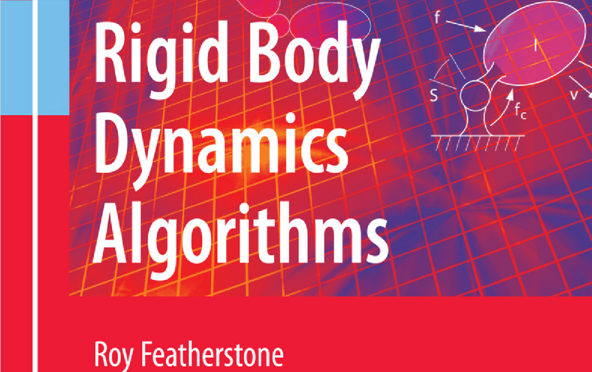

#! https://zhuanlan.zhihu.com/p/372852586

# 《刚体动力学算法笔记》Chapter1: 简介
## 简介
学习《Rigid Body Dynamics Algorithms》第二版的笔记。本书由[Roy  Featherstone教授](http://www.royfeatherstone.org/)编著，书中介绍了计算刚体动力学的大部分高效算法、闭环结构、浮动基等常用算法。

刚体动力学在电子游戏、动画、虚拟现实、仿真、运动控制系统中均有广泛应用。在这些场景中，计算机通过计算力、加速度等物理量来近似现实物理系统中的运动。书中采用六维的空间向量(第二章中会详细讲到)来表示空间力和运动。

## 动力学算法
刚体动力学定义了运动方程，来描述作用在物理系统上的力和产生的加速度的关系。动力学算法则是计算这些物理量数值解的方法。我们主要关注两种类型的动力学：
* **前向动力学(forward dynamics):** 给定刚体系统广义作用力，计算系统加速度，主要用于仿真。
* **逆动力学(inverse dynamics):** 给定响应的加速度，计算刚体系统所需施加的广义力，可应用于运动控制、轨迹规划等多个方面。

刚体平衡方程可以写成：
$$ \mathbf{\tau} = \mathbf{H(q)}\mathbf{\ddot{q}}+\mathbf{C(q,\dot{q})} $$

其中$q, \dot{q}, \ddot{q}$分别表示位置、速度和加速度。$\tau$是施加的力。$\mathbf{H}$是由$\mathbf{q}$确定的惯量矩阵，$\mathbf{C}$是科氏力、离心力、重力和其他作用在系统上的非驱动外力。$\mathbf{H}和\mathbf{C}$在计算过程中已知，而$\dot{q}和\ddot{q}$为变量。

* **系统模型(system model):** 系统模型描述了系统本身，数学模型(mathematical model)则描述了系统表现的某些层面。
  
引入系统模型的概念，因为从编程角度考虑，某个具体模型可以作为系统模型的参数，模型值可以定义成包含具体刚体系统的数据结构，从而实现泛化。如前向、逆向动力学系统模型可以分别表示为:
$$\mathbf{\ddot{q}}=FD(model,\mathbf{q,\dot{q},\tau}) \quad,\quad \tau = ID(model, \mathbf{q, \dot{q},\ddot{q}})$$

基于这种系统模型的控制方法称作**基于模型的方法 (model-based algrithm)**。两种常见的系统模型类是运动链(kinematic tree)和闭环系统(closed-loop system)，也是本书中主要涉及的建模对象。

## 空间向量
刚体在三维空间中有六个自由度，一般需要两个方程来表示平移和旋转:
$$\mathbf{f}=m\mathbf{a_C} \quad,\quad \mathbf{n_C=I\dot{\omega}+\omega \times I \omega} $$
在空间向量表示中，我们使用六维向量来表示刚体的运动状态:
$$\mathbf{f=Ia+v\times ^* Iv}$$
其中$\bm{f}$是作用在刚体上的空间力，$\bm{v}和\bm{a}$是空间速度和加速度。$\bf{I}$是空间惯性张量。这种空间向量表示方法简化了很多。如如果两个刚体组合在一起形成一个整体，空间张量可以表示成$\bm{I_{new}=I_1+I_2}$。

机器人学科中，除了这种六维空间向量外，还有通过旋量来表示刚体运动。[Modern Robotics](https://zhuanlan.zhihu.com/p/143372318)提供了关于旋量不错的入门教程。但是注意这里的六维空间向量跟旋量不完全相同。为什么要使用空间向量而不是更简单的旋量表示?主要是因为存在大量机器人软件采用了六维空间向量，如MuJoCo、RaiSim物理引擎、MIT Cheetah等控制代码。并且基于六维空间向量的算法有高效、稳定的实现如[rbdl](https://github.com/rbdl/rbdl)、[Pinocchio](https://github.com/stack-of-tasks/pinocchio)。

## 目录

本书组织上，第2章介绍空间向量代数，第3章分析刚体系统的动力学和运动。第4章介绍了系统模型的组件。

5~7章介绍了kinematic tree的几个重要算法：recursive Newton-Euler 逆动力学算法、前向动力学的composite-rigid-body & articulated-body 算法。第8章介绍了closed-loop systems动力学。

9~11章涉及了其他研究点。第9章主要介绍了floating-base systems的混合动力学算法。第10章探讨了数值稳定性和计算效率。第11章涉及跟物体接触和冲击的情况处理。

